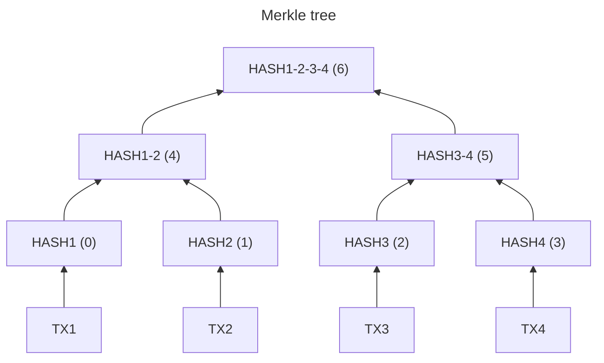

```mermaid
---
title: Merkle tree
---
flowchart BT
	TX1 --> HASH1["HASH1 (0)"]
	TX2 --> HASH2["HASH2 (1)"]
	TX3 --> HASH3["HASH3 (2)"]
	TX4 --> HASH4["HASH4 (3)"]

	HASH1 --> HASH1-2["HASH1-2 (4)"]
	HASH2 --> HASH1-2

	HASH3 --> HASH3-4["HASH3-4 (5)"]
	HASH4 --> HASH3-4

	HASH1-2 --> HASH1-2-3-4["HASH1-2-3-4 (6)"]
	HASH3-4 --> HASH1-2-3-4
```
